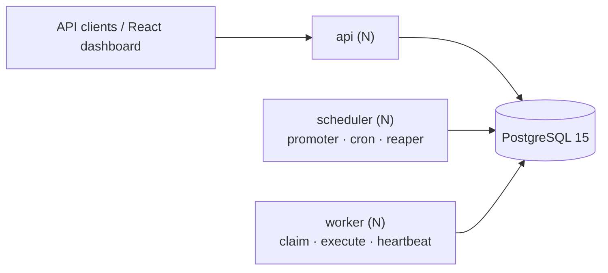

# Codity — Distributed Job Scheduler

A production-inspired background job platform: submit jobs over a REST API, and a fleet of worker
processes claims and executes them across machines. Jobs can be immediate, delayed, scheduled,
recurring (cron), or submitted in batches. Failures retry with jittered backoff, permanent failures
land in a dead letter queue an operator can inspect and replay, and a worker that dies mid-job has
its work reclaimed and finished by another — **without ever running the job twice against the same
attempt**.

**The architecture in three sentences.** Three stateless process types — `api`, `worker`,
`scheduler` — share nothing but a single PostgreSQL 15 database; there is no Redis, no Celery, and no
broker. Workers claim jobs with a single `SELECT … FOR UPDATE SKIP LOCKED` statement that transitions
the job and opens its execution row atomically, so K workers partition the ready set with no
coordination and no blocking. Every ownership change bumps a `lease_epoch` fencing token, so a
worker that stalls and is reclaimed can never commit a stale result — which is what makes crash
recovery safe rather than merely likely.



---

## ⚠️ Nothing executes without a running worker

This is the single most likely way to conclude the system is broken when it is working exactly as
designed.

The API **accepts** jobs and returns `201`. It never executes them. A job stays in `status: "queued"`
until a `worker` process claims it. If you POST a job with no worker running, you will see a job that
never moves — that is correct behaviour, not a bug.

You need **three** processes, in three terminals: `make api`, `make worker`, `make scheduler`.

The scheduler is not optional either. Without it, *immediate* jobs still flow perfectly while every
*delayed* job, every *cron* occurrence, and **every backoff retry** stalls silently. That is the most
confusing failure the system can have, which is why the scheduler's last-tick age is reported at
`GET /api/v1/system/status` and shown on the dashboard.

---

## Quickstart — no Docker required

macOS with Homebrew, PostgreSQL 15, Python 3.13, and [`uv`](https://docs.astral.sh/uv/). Docker is
not used anywhere in this project, including in the tests.

Start PostgreSQL:

```bash
brew services start postgresql@15
```

Create the two databases (the second is for the test suite):

```bash
createdb codity && createdb codity_test
```

Install Python dependencies:

```bash
cd backend && uv sync
```

Apply migrations:

```bash
cd backend && uv run alembic upgrade head
```

Seed a demo organization, project, queues and handlers:

```bash
cd backend && uv run python scripts/seed.py
```

The seed prints an **organization id** and a login. Keep the org id — the worker needs it, because a
worker connects to Postgres directly and must be told which tenant it serves.

### Run the system — four terminals

API:

```bash
cd backend && uv run uvicorn app.main:app --reload --port 8000
```

Worker (substitute the org id printed by the seed):

```bash
cd backend && uv run python -m app.worker.main --org "$CODITY_ORG_ID" --name worker-1 --concurrency 4
```

Scheduler:

```bash
cd backend && uv run python -m app.scheduler.main
```

Dashboard:

```bash
cd frontend && npm install && npm run dev
```

Then open <http://localhost:5173> for the dashboard and <http://localhost:8000/docs> for Swagger.

### Or use the Makefile

Every command above has a target. `make` on its own lists them.

```bash
make setup && make migrate && make seed
```

`make api` · `make worker` · `make worker2` · `make scheduler` · `make demo` · `make test` ·
`make check`

`make worker` resolves the org id from the local database automatically; override with
`make worker ORG=<uuid>`.

---

## See it work

**[`docs/GRADER_WALKTHROUGH.md`](docs/GRADER_WALKTHROUGH.md) is a numbered ~10 minute path** through
every capability, with each step annotated by what it demonstrates. The short version:

```bash
make demo
```

500 jobs across 3 queues with a handler that fails ~20% of the time. The throughput chart moves,
failures retry with visibly increasing gaps, and some jobs reach the DLQ. At the end it prints an
invariant block:

```
duplicate first-attempt executions = 0
terminal == enqueued
```

Then start a second worker, re-run the load, and send `SIGKILL` to the first one mid-flight. Within
one lease period the reaper reclaims its jobs, worker-2 finishes them, and the job timeline shows

```
attempt 1 · claimed by worker-1 → lease expired (lost)
attempt 2 · claimed by worker-2 → running → completed
```

with the invariant block still clean. That is the whole design in one screen.

---

## Documentation

| Document | What is in it |
|---|---|
| [`docs/ARCHITECTURE.md`](docs/ARCHITECTURE.md) | Process topology, architecture diagram, module layout, the layering rule, observability |
| [`docs/DATABASE.md`](docs/DATABASE.md) | ER diagram, table-by-table rationale, every index and the query it serves, the status state machine |
| [`docs/DESIGN_DECISIONS.md`](docs/DESIGN_DECISIONS.md) | ADR-lite: 17 decisions, each with the option rejected and why |
| [`docs/API.md`](docs/API.md) | Endpoints, auth, error envelope, keyset pagination, idempotency |
| [`docs/SCHEMA_NAMES.md`](docs/SCHEMA_NAMES.md) | The canonical data dictionary. Every other document cites it |
| [`docs/TESTING.md`](docs/TESTING.md) | What is tested, why the concurrency fixtures are separate, and what is deliberately not tested |
| [`docs/GRADER_WALKTHROUGH.md`](docs/GRADER_WALKTHROUGH.md) | The 10-minute tour |

Diagrams are inline Mermaid, so they render on GitHub and change in the same diff as the code they
describe.

---

## Reliability, in one table

| Failure | Detection | Recovery | Residual risk |
|---|---|---|---|
| Worker killed mid-job | `lease_expires_at < now()` | Reaper closes the execution as `lost`, requeues the job, bumps the epoch | Side effects from the dead attempt already happened — handler idempotency covers it |
| Worker slow, stopped, or partitioned | Heartbeat stops | Reaper reclaims; the zombie's writes are rejected by the epoch fence | The zombie's external side effect cannot be un-sent |
| Database connection lost mid-job | asyncpg raises | Job never transitions; the lease expires; the reaper requeues | One extra attempt consumed only if the job had started |
| Job exceeds `timeout_ms` | `asyncio.wait_for` | Marked `timed_out`, counts as a failed attempt, backs off | A blocking handler runs to completion in its thread; bounded by `timeout_ms < lease_seconds × 1000` |
| Poison-pill job | Attempt budget exhausts | Dead-lettered with an error fingerprint; the DLQ groups by fingerprint | None |
| Two schedulers race a cron occurrence | — | `UNIQUE (schedule_id, scheduled_for)` | None |
| Clock skew between nodes | — | All time comes from `now()` **inside Postgres**; no process compares its own clock to a lease | None by construction |

**Delivery is at-least-once, and the docs say so.** Exactly-once across a process boundary is
impossible — a worker cannot atomically commit "job done" to Postgres and "email sent" to a
third-party API. What *is* guaranteed: at most one worker holds a valid lease at any instant, at most
one execution can record a result for a given `lease_epoch`, and handlers are given a written
idempotency contract. See [ADR-005](docs/DESIGN_DECISIONS.md).

---

## Deliberately deferred

Each of these was designed, costed, and cut on purpose. The design and the migration path for each is
written down, so none of them is a surprise later.

| Deferred | Why | Where the design lives |
|---|---|---|
| **PostgreSQL RLS** | A *second* enforcement layer for something already enforced by composite foreign keys and an automatic query predicate, and asserted by a CI test. Roughly a day, and every fixture or migration that forgets to set the GUC becomes an opaque "zero rows, no error" debugging session. That day went to the reliability core instead. | [ADR-013](docs/DESIGN_DECISIONS.md) — including the exact policy DDL |
| **`api_keys` (service-to-service auth)** | Nothing consumes it yet. The dashboard uses JWT, and workers connect to Postgres directly rather than through the API, so an API key would be an unused table with an unused rotation story. It becomes necessary the moment a third-party service posts jobs. | [`docs/API.md`](docs/API.md) §2 |
| **Four-tier RBAC (`owner/admin/operator/viewer`)** | RBAC is listed as a *bonus*. A four-tier ladder puts a bonus on the critical path of every endpoint and multiplies the auth test matrix by four. Two roles (`owner`, `member`) ship; the ladder slots into the same dependency as `require_role(min_role)` with no schema change beyond widening a CHECK. | [ADR-014](docs/DESIGN_DECISIONS.md) |
| **WebSocket live updates** | Also a listed *bonus*. Reconnect-with-backoff, auth on upgrade, resubscribe, server-side fanout, and missed-event reconciliation are a lot of subtle code. Polling is correct by construction — every poll re-reads the truth — and its cost is bounded: terminal jobs stop polling, hidden tabs pause. The polling hooks are the seam if the transport is swapped later. | [ADR-015](docs/DESIGN_DECISIONS.md) |
| **Table partitioning** | Monthly declarative partitioning of `job_logs` and `job_executions` turns retention into a partition detach. At this volume the batched sweep is measurably sufficient, and partitioning would add migration complexity with no observable benefit. | [`docs/DATABASE.md`](docs/DATABASE.md) §7 |
| **Queue sharding** | Claims are serialised *per queue* by the `FOR NO KEY UPDATE` lock that makes `max_concurrency` exact. Hashing `queue_id` into shards removes that serialisation — worth doing when one queue needs more claim throughput than one short statement provides, and not before. | [ADR-003](docs/DESIGN_DECISIONS.md) |
| **Duration percentiles** | The per-minute rollup stores `sum_duration_ms` and `max_duration_ms`, so mean and max are available. True percentiles need a second rollup pass over raw durations. | [`docs/ARCHITECTURE.md`](docs/ARCHITECTURE.md) §5 |

An exactly-once *delivery* guarantee is not on this list, because it is not deferred — it is
impossible, and claiming it would be the least honest thing in the repository.

---

## Development

```bash
make check
```

ruff + mypy (strict) + the full test suite. Run it before every commit.

```bash
make test-concurrency
```

Just the concurrency tests, which run against real committed sessions — one connection per simulated
worker, because `SKIP LOCKED` semantics do not exist inside a single transaction.

Tests run against a real local `codity_test` database. **No testcontainers**, because Docker is not
available here and because the behaviour under test is genuine PostgreSQL locking, which does not
survive being mocked. Details in [`docs/TESTING.md`](docs/TESTING.md).

---

## Troubleshooting

**A job stays `queued` and never runs.**
No worker is running, or the worker is subscribed to a different queue or a different organization.
Check the worker terminal for claim logs, and check `GET /api/v1/orgs/{org_id}/workers` — a queue
with no assigned worker is indistinguishable from an idle queue unless you look.

**Delayed, scheduled, or retried jobs never become `queued`, but immediate jobs work fine.**
The scheduler is not running. Confirm with `GET /api/v1/system/status`: `promoter.last_run_at` will
be stale. Start it with `make scheduler`.

**`createdb: database "codity" already exists`**
Harmless — it already exists. `make setup` tolerates this.

**`connection refused` on port 5432.**
PostgreSQL is not running: `brew services start postgresql@15`. Confirm with `psql -l`.

**`FATAL: database "codity_test" does not exist` when running tests.**
Run `createdb codity_test`, or `make setup`.

**`alembic upgrade head` reports a conflicting head.**
Two migration branches exist. `uv run alembic heads` shows them; they need a merge revision.

**Everything is slow and jobs claim in bursts.**
Expected under a low `max_concurrency` — the cap is exact, and claims for one queue are serialised by
design. Raise `max_concurrency`, or spread the load across more queues
([ADR-003](docs/DESIGN_DECISIONS.md)).

**A job says `dead_letter` but the handler looks correct.**
Check `last_error_class`. `LeaseExpired` means the lease ran out rather than the handler failing —
usually a blocking handler that did not use `asyncio.to_thread` and froze the event loop, which
starves the heartbeat for *every* job on that worker.

**The dashboard shows 401 after a page reload.**
The access token is short-lived and refreshed from an httpOnly cookie. If the cookie is missing, the
API and the dashboard are on origins the CORS config does not allow — check `CODITY_CORS_ORIGINS`.

**A test that spawns concurrent workers passes suspiciously.**
It is probably using the rollback `db` fixture. Concurrency tests need `db_committed` and separate
sessions; see [`docs/TESTING.md`](docs/TESTING.md) §2.

---

## Stack

Python 3.13 · FastAPI · Pydantic v2 · SQLAlchemy 2.0 (async) · Alembic · asyncpg · PostgreSQL 15 ·
React + TypeScript + Vite + TanStack Query + Tailwind · `uv`

PostgreSQL is the only infrastructure dependency. That is the point.
