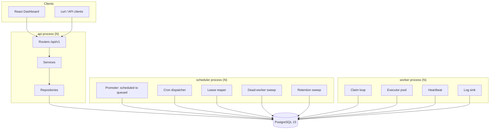

# Architecture

Codity is a distributed job scheduler whose only infrastructure dependency is PostgreSQL 15. Jobs
are submitted over a REST API and executed by a fleet of worker processes that claim work with
`SELECT … FOR UPDATE SKIP LOCKED`. There is no Redis, no Celery, and no broker.

Names used below are defined once in [`SCHEMA_NAMES.md`](SCHEMA_NAMES.md). Rationale for each choice
is in [`DESIGN_DECISIONS.md`](DESIGN_DECISIONS.md).

---

## 1. Process topology

Three process types. All are stateless, all speak only to Postgres, and all can be scaled to N
replicas without coordination.

| Process | Owns | Scaling |
|---|---|---|
| `api` | FastAPI/uvicorn. HTTP, auth, validation, job creation, dashboard reads. **Never claims jobs.** | N replicas, stateless |
| `worker` | Claim → execute → complete/fail. Heartbeats. Graceful drain. | N replicas; this is the throughput knob |
| `scheduler` | Promoter, cron dispatcher, lease reaper, dead-worker sweep, retention sweep. | N replicas; correctness does not depend on N=1 |



Every arrow terminates at Postgres. The processes never talk to each other. That is the whole
coordination story: **all shared state, all mutual exclusion, and all ordering live in the
database**, which is why any of the three can be killed, restarted, or duplicated without a protocol
to renegotiate.

### Why the scheduler is its own process

It is not an API background task, because that ties job liveness to HTTP traffic — a system with no
requests stops promoting delayed jobs — and it double-fires on every API replica.

It is not a leader-elected worker role, because leader election is a distributed-systems problem
this system does not need to solve. Correctness under N schedulers comes from the database:

- **Cron double-promotion is impossible** — `UNIQUE (schedule_id, scheduled_for)` on `jobs`.
- **Reaper/promoter overlap is harmless** — every statement is `FOR UPDATE SKIP LOCKED`, so two
  schedulers *partition* the work instead of colliding.

A `pg_try_advisory_lock` is used only to stop redundant ticks burning CPU. If it is never acquired,
the system is still correct. That is the test of whether a lock is load-bearing: remove it and see
whether an invariant breaks. This one does not.

### Worker identity and queue subscription

A worker connects to Postgres directly, so it must be told which tenant it serves: `--org <uuid>`
(or `CODITY_ORG_ID`) is validated at startup. `--queues` takes `project-slug/queue-name` pairs,
because queue names are unique per project and not globally.

On boot the worker upserts its `workers` row keyed on `(organization_id, name)` where the default
name is `{hostname}-{pid}`, and populates `worker_queue_assignments`. A retention rule deletes
`workers` rows in status `dead`/`stopped` older than 24h, so restarts do not leave the fleet screen
full of corpses.

Per polling cycle the worker iterates its queues in **weighted-random order by `queues.priority`**,
issuing one claim statement per queue and capping each queue's share at `ceil(batch_size /
n_queues)`. Weighted-random rather than strict ordering is what stops a busy high-priority queue
starving a low-priority one — and both properties are testable.

---

## 2. Module layout

```
Codity/
├── backend/
│   ├── app/
│   │   ├── main.py                  # FastAPI app factory
│   │   ├── config.py                # pydantic-settings, CODITY_ prefix
│   │   ├── domain/                  # FastAPI-free: enums, errors, backoff, cron
│   │   ├── db/
│   │   │   ├── session.py
│   │   │   ├── models/              # SQLAlchemy models, one module per cluster
│   │   │   └── sql/                 # raw .sql for the hot path
│   │   │       ├── claim_jobs.sql
│   │   │       ├── start_job.sql
│   │   │       ├── complete_job.sql
│   │   │       ├── fail_job.sql
│   │   │       ├── reap_leases.sql
│   │   │       ├── promote_due.sql
│   │   │       └── heartbeat.sql
│   │   ├── repositories/
│   │   ├── services/                # jobs, queues, claim, idempotency
│   │   ├── api/
│   │   │   ├── deps.py              # auth, scope resolution
│   │   │   ├── errors.py            # exception handlers, one envelope
│   │   │   ├── middleware/request_context.py
│   │   │   └── routers/             # auth, projects, queues, jobs, workers, dlq, metrics
│   │   ├── worker/
│   │   │   ├── main.py              # CLI entrypoint
│   │   │   ├── runner.py            # claim loop, executor pool, heartbeat, drain
│   │   │   ├── logsink.py           # the only writer of job_logs
│   │   │   └── handlers/            # echo, sleep, http_request, flaky, cpu_burn
│   │   └── scheduler/main.py        # promoter, cron, reaper, sweeps
│   ├── alembic/versions/
│   ├── scripts/                     # seed.py, demo_load.py, export_openapi.py
│   ├── tests/
│   └── pyproject.toml
├── frontend/
├── docs/
└── Makefile
```

The **hot path is raw SQL in `.sql` files**, not ORM expressions. The claim, start, complete, fail,
reap, promote and heartbeat statements are each a single multi-CTE statement whose exact shape is
the correctness argument. Keeping them as SQL means they are reviewable as SQL, can be pasted into
`psql` and `EXPLAIN`ed directly, and cannot be silently restructured by a query-compiler change. The
ORM owns CRUD, where its ergonomics pay off and its generated SQL does not matter.

---

## 3. The layering rule

```
routers → services → repositories → models
```

over a FastAPI-free `domain/`.

- `domain/` imports nothing from `app.api`, `app.db`, or `fastapi`. It is pure: enums, errors,
  backoff arithmetic, cron helpers.
- `services/` and `repositories/` never import `fastapi`. **This is what lets the worker and the
  scheduler reuse `services/claim.py` without dragging in the web framework** — the rule exists for
  that specific reason, not as decoration.
- Routers hold no business logic; they translate HTTP to service calls and back.
- Nothing outside `app/api/` raises `HTTPException`. Services raise `DomainError` subclasses, and
  `app/api/errors.py` is the only place that knows about status codes.

A test walks the AST of every module under `backend/app/` and asserts these import rules, so the
layering is **enforced rather than aspirational**. A layering rule nobody checks is a comment.

---

## 4. Request and job lifecycle

1. `POST /api/v1/queues/{queue_id}/jobs` arrives. `RequestContextMiddleware` mints a
   `request_id` and binds it into structlog's contextvars.
2. The router validates the discriminated union on `kind`, resolves the principal, and calls
   `services/jobs.py`.
3. The service snapshots the queue's policy onto the job — `lease_seconds` from
   `queues.visibility_timeout_sec`, `timeout_ms`, `max_attempts`, backoff parameters, priority — and
   persists `request_id` as `jobs.correlation_id`. Snapshotting is what stops an edited queue or
   retry policy retroactively changing the backoff of jobs already mid-retry.
4. Status on creation: `immediate` and `batch` → `queued` with `run_at = now()`; `delayed`,
   `scheduled`, `recurring` → `scheduled`.
5. The promoter moves due `scheduled` rows to `queued`. A worker claims, starts, executes, and
   completes or fails. Failure with budget remaining goes back to `scheduled` with a jittered future
   `run_at`; exhausted budget dead-letters.

The mechanics of each transition — the claim statement, the epoch fence, the reaper, backoff — are
in [`DESIGN_DECISIONS.md`](DESIGN_DECISIONS.md) and [`DATABASE.md`](DATABASE.md).

---

## 5. Observability

**Structured logs.** `structlog` renders JSON. A `correlation_id` is generated per HTTP request,
persisted on `jobs.correlation_id`, and re-bound by the worker when it claims — so **one `grep`
follows a job from the POST that created it through every retry on every worker**, across process
boundaries, without a tracing backend.

**Health endpoints.**

| Endpoint | Answers |
|---|---|
| `GET /healthz` | Is the process alive? No I/O. |
| `GET /readyz` | Is the database reachable and are migrations current? |
| `GET /api/v1/system/status` | Worker count live/dead, oldest overdue scheduled job, DLQ depth, **scheduler last-tick age**. |

**Cross-process staleness.** The last-tick age needs a home in the database, because the API and the
scheduler are different processes — an in-process gauge is invisible to the endpoint that has to
report it. A four-column table solves it:

```sql
CREATE TABLE system_state (
    name        text PRIMARY KEY,   -- 'promoter' | 'cron' | 'reaper' | 'retention'
    last_run_at timestamptz NOT NULL,
    last_error  text,
    updated_at  timestamptz NOT NULL DEFAULT now()
);
```

Every scheduler loop upserts its row on every tick. This converts the system's biggest silent-failure
mode — **a dead promoter, which stalls every delayed job *and* every backoff retry while immediate
jobs keep flowing perfectly** — from an invisible outage into a number on the dashboard. It is the
one failure that looks like nothing is wrong.

**Metrics.** `queue_stats_minute` is a per-minute rollup (`enqueued`, `completed`, `failed`,
`dead_lettered`, `sum_duration_ms`, `max_duration_ms`) written by the scheduler. The throughput
chart reads the rollup, not `jobs` — a dashboard that aggregates the hot table is a dashboard that
competes with the claim path for the same pages.
