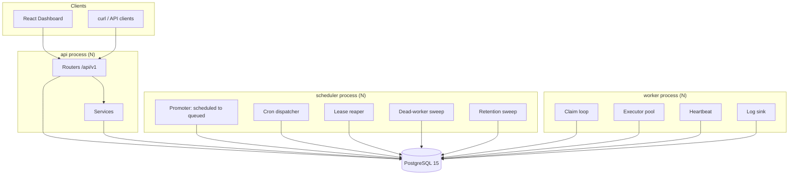

# Architecture

Codity is a distributed job scheduler whose only infrastructure dependency is PostgreSQL 15. Jobs
are submitted over a REST API and executed by a fleet of worker processes that claim work with
`SELECT … FOR UPDATE SKIP LOCKED`. There is no Redis, no Celery, and no broker.

Names used below are defined once in [`SCHEMA_NAMES.md`](SCHEMA_NAMES.md). Rationale for each choice
is in [`DESIGN_DECISIONS.md`](DESIGN_DECISIONS.md).

---

## 1. Process topology

Three process types. All are stateless, all speak only to Postgres, and all can be scaled to N
replicas without coordination.

| Process | Owns | Scaling |
|---|---|---|
| `api` | FastAPI/uvicorn. HTTP, auth, validation, job creation, dashboard reads. **Never claims jobs.** | N replicas, stateless |
| `worker` | Claim → execute → complete/fail. Heartbeats. Graceful drain. | N replicas; this is the throughput knob |
| `scheduler` | Promoter, cron dispatcher, lease reaper, dead-worker sweep, retention sweep. | N replicas; correctness does not depend on N=1 |

### What "the throughput knob" is actually worth

`backend/scripts/bench_claim.py` measures the claim path alone — `lock_queue.sql` +
`claim_jobs.sql` + `COMMIT`, no handler execution — against a fixed backlog, with one dedicated
Postgres backend per claimer:

| Claimers | Claims/s | p50 | p95 | Disjoint |
|---:|---:|---:|---:|:--|
| 1 | 6,997 | 1.35 ms | 1.89 ms | PASS |
| 2 | 7,264 | 2.64 ms | 3.76 ms | PASS |
| 4 | 6,960 | 5.48 ms | 8.18 ms | PASS |
| 8 | 7,663 | 8.92 ms | 17.29 ms | PASS |

**The flat curve is the finding, not a disappointment.** Claims against *one queue* serialise on
that queue's row lock — which is precisely what makes `max_concurrency` an exact cap rather than an
approximate one ([ADR-003](DESIGN_DECISIONS.md)). Adding claimers to a single queue redistributes
the same ~7k claims/s among more waiters rather than multiplying it, and p95 climbing from 1.9 ms to
17.3 ms is that queueing made visible. Throughput scales with **queues**, not with claimers per
queue; when one queue genuinely needs more, sharding it is the documented next step.

Read the throughput column only alongside the disjointness column. A claim path that hands the same
job to two workers can be made arbitrarily fast.



Every arrow terminates at Postgres. The processes never talk to each other. That is the whole
coordination story: **all shared state, all mutual exclusion, and all ordering live in the
database**, which is why any of the three can be killed, restarted, or duplicated without a protocol
to renegotiate.

### Why the scheduler is its own process

It is not an API background task, because that ties job liveness to HTTP traffic — a system with no
requests stops promoting delayed jobs — and it double-fires on every API replica.

It is not a leader-elected worker role, because leader election is a distributed-systems problem
this system does not need to solve. Correctness under N schedulers comes from the database:

- **Cron double-promotion is impossible** — `UNIQUE (schedule_id, scheduled_for)` on `jobs`.
- **Reaper/promoter overlap is harmless** — every statement is `FOR UPDATE SKIP LOCKED`, so two
  schedulers *partition* the work instead of colliding.

A `pg_try_advisory_lock` is used only to stop redundant ticks burning CPU. If it is never acquired,
the system is still correct. That is the test of whether a lock is load-bearing: remove it and see
whether an invariant breaks. This one does not.

### Worker identity and queue subscription

A worker connects to Postgres directly, so it must be told which tenant it serves: **`--org <uuid>`
is a required CLI argument**, and it is the only way to pass the tenant. There is deliberately no
`CODITY_ORG_ID` environment variable — and exporting one would be actively harmful, because
`config.py` uses `env_prefix="CODITY_"` with `extra="forbid"`, so any unrecognised `CODITY_*` name in
the environment raises a `ValidationError` that takes down the API, the worker and the scheduler
alike. The worker's full argument list is `--org`, `--name` and `--concurrency`; there is **no
`--queues` flag**. A worker serves every non-paused queue in its organization, choosing between them
each polling cycle in weighted-random order by `queues.priority`. Per-queue subscription is not
implemented — see the deferred list in the README.

On boot the worker upserts its `workers` row keyed on `(organization_id, name)` where the default
name is `{hostname}-{pid}`. A retention rule deletes `workers` rows in status `dead`/`stopped` older
than 24h, so restarts do not leave the fleet screen full of corpses.

Queue subscription is **not persisted**: there is no `worker_queue_assignments` table, so the
database cannot answer "which workers serve this queue". The dashboard therefore cannot distinguish a
queue with no workers from an idle queue — see the deferred list in [`../README.md`](../README.md).

Per polling cycle the worker iterates its queues in **weighted-random order by `queues.priority`**,
issuing one claim statement per queue and capping each queue's share at `ceil(batch_size /
n_queues)`. Weighted-random rather than strict ordering is what stops a busy high-priority queue
starving a low-priority one — and both properties are testable.

---

## 2. Module layout

```
Codity/
├── backend/
│   ├── app/
│   │   ├── main.py                  # FastAPI app factory
│   │   ├── config.py                # pydantic-settings, CODITY_ prefix
│   │   ├── domain/                  # FastAPI-free: enums.py, errors.py, backoff.py
│   │   ├── db/
│   │   │   ├── session.py
│   │   │   ├── models/              # base, tenancy, scheduling, execution, observability
│   │   │   └── sql/                 # raw .sql for the hot path
│   │   │       ├── lock_queue.sql   # step 1 of the claim -- see ADR-003
│   │   │       ├── claim_jobs.sql   # step 2
│   │   │       ├── start_job.sql
│   │   │       ├── complete_job.sql
│   │   │       ├── fail_job.sql
│   │   │       ├── reap_leases.sql
│   │   │       ├── promote_due.sql
│   │   │       └── heartbeat.sql
│   │   ├── services/                # jobs, claim, idempotency, reliability, security
│   │   ├── api/
│   │   │   ├── deps.py              # auth, scope resolution
│   │   │   ├── errors.py            # exception handlers, one envelope
│   │   │   ├── pagination.py        # keyset cursors
│   │   │   ├── schemas.py           # every request/response model
│   │   │   ├── middleware/request_context.py
│   │   │   └── routers/             # auth, projects, jobs, schedules, workers, dlq,
│   │   │                            #   metrics, system
│   │   ├── worker/
│   │   │   ├── main.py              # CLI entrypoint (--org is required)
│   │   │   ├── runner.py            # claim loop, executor pool, heartbeat, drain
│   │   │   ├── logsink.py           # the only writer of job_logs
│   │   │   └── handlers/            # demo.echo, demo.sleep, demo.flaky,
│   │   │                            #   demo.always_fail, demo.cpu
│   │   └── scheduler/
│   │       ├── main.py              # process entrypoint
│   │       └── loops.py             # promoter, reaper, cron, dead-worker, retention
│   ├── alembic/versions/            # five revisions, hash-named -- DATABASE.md §9
│   ├── scripts/                     # seed.py, demo_load.py
│   ├── tests/
│   └── pyproject.toml
├── frontend/
├── docs/
└── Makefile
```

The **hot path is raw SQL in `.sql` files**, not ORM expressions. The claim, start, complete, fail,
reap, promote and heartbeat statements are each a single multi-CTE statement whose exact shape is
the correctness argument. Keeping them as SQL means they are reviewable as SQL, can be pasted into
`psql` and `EXPLAIN`ed directly, and cannot be silently restructured by a query-compiler change. The
ORM owns CRUD, where its ergonomics pay off and its generated SQL does not matter.

---

## 3. The layering rule

Three layers, not four:

```
routers → services → models
```

over a FastAPI-free `domain/`.

- `domain/` imports nothing from `app.api`, `app.db`, or `fastapi`. It is pure: enums, errors,
  backoff arithmetic. (Cron parsing is **not** here — it lives in `scheduler/loops.py`, which is the
  only caller.)
- `services/` never imports `fastapi`. **This is what lets the worker and the scheduler reuse
  `services/claim.py` without dragging in the web framework** — the rule exists for that specific
  reason, not as decoration, and the concurrency tests import the same module the worker does.
- Routers hold no business logic. They do, however, **issue `select()` directly** for reads: there
  is no repository layer between a router and the ORM.
- Nothing outside `app/api/` raises `HTTPException`. Services raise `DomainError` subclasses, and
  `app/api/errors.py` is the only place that knows about status codes.

**On `app/repositories/`:** the package exists and is **empty** — a zero-byte `__init__.py` and
nothing else. It is a placeholder for a repository layer that was planned and not built. Read reuse
across routers is currently duplication, and extracting it is the natural next refactor; until then,
treating the tree as three layers is the accurate reading.

**These rules are stated intent, not machine-checked.** No test walks the AST asserting them, so
nothing stops a future edit from importing `fastapi` into `services/`. The rule that matters most —
`services/claim.py` staying framework-free — is at least exercised indirectly: the worker process
and the concurrency tests both import it without FastAPI present, so breaking it breaks `make test`.
An explicit `test_layering_rules` that walks the imports is the honest fix, and it is not written.

---

## 4. Request and job lifecycle

1. `POST /api/v1/queues/{queue_id}/jobs` arrives. `RequestContextMiddleware` mints a
   `request_id` and binds it into structlog's contextvars.
2. The router validates the discriminated union on `kind`, resolves the principal, and calls
   `services/jobs.py`.
3. The service snapshots the queue's policy onto the job — `lease_seconds` from
   `queues.visibility_timeout_sec`, `timeout_ms`, `max_attempts`, backoff parameters, priority — and
   persists `request_id` as `jobs.correlation_id`. Snapshotting is what stops an edited queue or
   retry policy retroactively changing the backoff of jobs already mid-retry.
4. Status on creation: `immediate` and `batch` → `queued` with `run_at = now()`; `delayed`,
   `scheduled`, `recurring` → `scheduled`.
5. The promoter moves due `scheduled` rows to `queued`. A worker claims, starts, executes, and
   completes or fails. Failure with budget remaining goes back to `scheduled` with a jittered future
   `run_at`; exhausted budget dead-letters.

The mechanics of each transition — the claim statement, the epoch fence, the reaper, backoff — are
in [`DESIGN_DECISIONS.md`](DESIGN_DECISIONS.md) and [`DATABASE.md`](DATABASE.md).

---

## 5. Observability

**Structured logs.** `structlog` renders JSON. A `correlation_id` is generated per HTTP request,
persisted on `jobs.correlation_id`, and re-bound by the worker when it claims — so **one `grep`
follows a job from the POST that created it through every retry on every worker**, across process
boundaries, without a tracing backend.

**Health endpoints.**

| Endpoint | Answers |
|---|---|
| `GET /healthz` | Is the process alive? No I/O. |
| `GET /readyz` | Is the database reachable? It opens a connection and runs `select 1`. It does **not** check that migrations are current — a schema-version probe is not implemented. |
| `GET /api/v1/system/status` | Worker count live/dead, oldest overdue scheduled job, DLQ depth, **scheduler last-tick age**. |

**Cross-process staleness.** The last-tick age needs a home in the database, because the API and the
scheduler are different processes — an in-process gauge is invisible to the endpoint that has to
report it. A four-column table solves it:

```sql
CREATE TABLE system_state (
    name        text PRIMARY KEY,   -- 'promoter' | 'reaper' | 'cron' | 'dead_worker' | 'retention'
    last_run_at timestamptz NOT NULL,
    last_error  text,
    updated_at  timestamptz NOT NULL DEFAULT now()
);
```

All five scheduler loops upsert their row on every tick. This converts the system's biggest
silent-failure mode — **a dead promoter, which stalls every delayed job *and* every backoff retry
while immediate jobs keep flowing perfectly** — from an invisible outage into a number on the
dashboard. It is the one failure that looks like nothing is wrong.

**Metrics.** The throughput and summary endpoints aggregate `jobs` and `job_executions`
**directly**, bucketed by minute with `date_trunc` and gap-filled with `generate_series` so an idle
minute returns an explicit zero rather than a missing row. Enqueues bucket by `jobs.created_at`,
terminal outcomes by `jobs.finished_at`, and durations by `job_executions.finished_at`; `retried`
counts executions with `attempt_number > 1`.

Aggregating the source tables was chosen over a pre-computed rollup deliberately. A rollup is a
second source of truth: it can drift from the tables it summarises, it needs a backfill for history
predating it, and it needs its own tests to prove it has not drifted. Reading the source tables is
correct by construction. The cost is that a throughput request scans a slice of `jobs` and
`job_executions` rather than a small rollup — bounded by `ix_jobs_project_created`,
`ix_jobs_queue_status_created` and `ix_job_executions_job`, and by the window itself. **Revisit if**
a metrics request starts competing with the claim path for the same pages; at that point a rollup
loop folding closed `job_executions` into minute buckets becomes worth its consistency cost.

`mean_duration_ms` and `success_rate` return `null` rather than `0` when a window contains nothing
measurable. A zero would assert "no time elapsed" and "nothing succeeded", which is a different
claim from "there is nothing here".

**`queue_stats_minute` is vestigial.** The table still exists (migration `eb052146b351`) and
`scripts/seed.py` backfills it, but nothing in the application reads it. It is a leftover of the
rollup design described above, and a candidate for removal.
