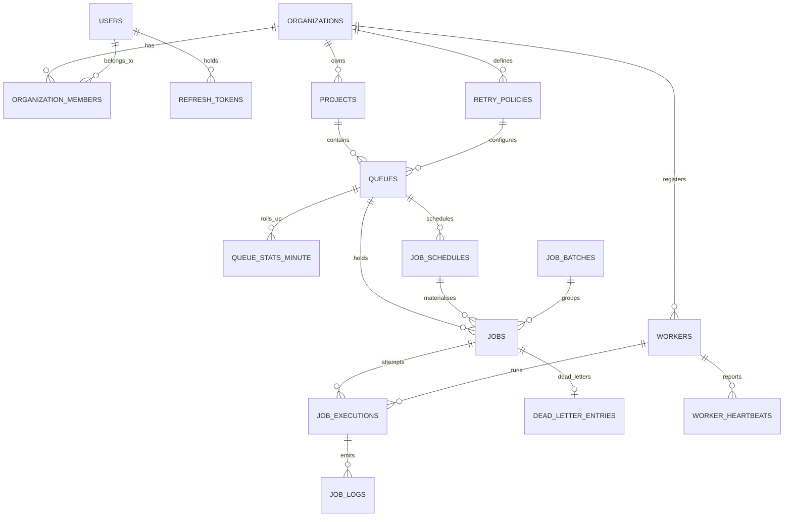
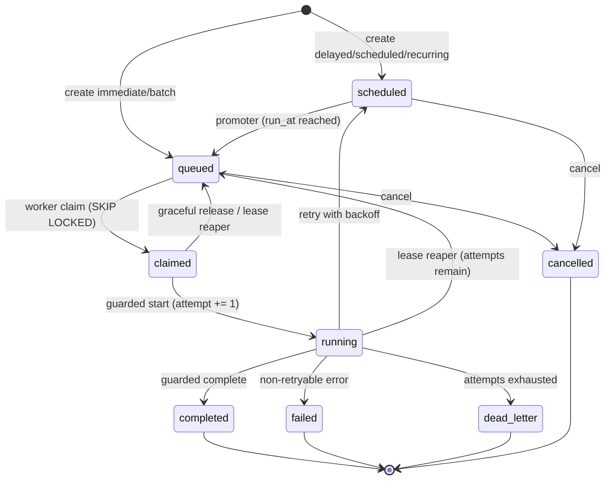

# Database Design

PostgreSQL 15 is the whole backend: system of record, queue substrate, lock manager, and clock.
Column and value names come from [`SCHEMA_NAMES.md`](SCHEMA_NAMES.md); the rationale behind each
structural choice is in [`DESIGN_DECISIONS.md`](DESIGN_DECISIONS.md).

Seventeen tables — sixteen entity tables plus `queue_stats_minute`, which is now vestigial (see
below). Tables land in migration order across build slices; `uv run alembic current` and `\dt` in
`psql` show what is live in your database right now.

---

## 1. Conventions

- **UUIDv7, application-generated** for entity tables. Time-ordered, so inserts stay on the
  rightmost index page instead of dirtying a random leaf per row the way UUIDv4 does;
  non-enumerable, unlike a `bigint`; and generable by the client before the round trip.
- **`bigint GENERATED ALWAYS AS IDENTITY`** for the append-only high-volume children
  (`job_executions`, `job_logs`, `worker_heartbeats`, `queue_stats_minute`). They are never
  referenced externally, and 8 bytes beats 16 on the tables that grow fastest.
- **All timestamps `timestamptz`.** No naive timestamps anywhere, in the schema or in Python.
- **Native `ENUM`** for `job_status` and `execution_status`, because they drive partial indexes and
  the set is closed. **`TEXT` + `CHECK`** everywhere else, so values can evolve without `ALTER TYPE`
  and its lock.
- **`server_default=text(...)`, never a plain Python string.** A plain string is emitted as a DDL
  *literal*, which freezes the value at migration time — `now()` becomes the instant the migration
  ran. Every column a raw-SQL `INSERT` touches carries a server default, because raw SQL bypasses
  ORM defaults entirely.
- **Composite foreign keys carry the tenant.** `jobs` has `UNIQUE (id, organization_id)`, and
  `job_executions` references `(job_id, organization_id)`. A cross-tenant child row is therefore
  physically impossible rather than merely unlikely.

---

## 2. Entity relationships



`system_state` is omitted from the diagram: it has no entity relationship worth drawing. It is
described in §3.

---

## 3. Table by table, and why it exists

### Tenancy and identity

| Table | Why |
|---|---|
| `organizations` | The tenant boundary. Every tenant-scoped table carries `organization_id`, and the composite FKs above make it non-forgeable. |
| `users` | Global identity. Argon2id password hash, plus `token_version` for global revocation on password change. |
| `organization_members` | Join table carrying `role` (`owner` \| `member`). PK `(organization_id, user_id)`. There is **no** last-owner guard: membership mutation endpoints are not built (see [`API.md`](API.md) §1), so nothing can currently demote the last owner, and the guard lands with the endpoint that needs it. |
| `refresh_tokens` | Refresh tokens keyed by `jti`, issued and persisted at register/login. `replaced_by_jti` is **declared but never written**: rotation and reuse detection need a `/auth/refresh` endpoint, and that endpoint is not built (see [`API.md`](API.md) §2). The column is the schema half of a feature whose behaviour half is deferred. |
| `projects` | Namespace inside an org. Queue names are unique per project, not globally — which is why the worker's `--queues` takes `project-slug/queue-name`. |

### Configuration

| Table | Why |
|---|---|
| `retry_policies` | The spec names retry policies as an entity. Own table so a policy is reusable and nameable across queues — **and its values are snapshotted onto `jobs` at enqueue**, so editing a policy never retroactively changes the backoff of jobs already mid-retry. Referenced `ON DELETE RESTRICT`. |
| `queues` | The unit of concurrency, priority, lease length, payload limit, and pause. Carries `max_concurrency`, `priority`, `default_priority`, `visibility_timeout_sec`, `default_timeout_ms`, `max_payload_bytes`, `is_paused`/`paused_at`, `log_retention_days`. |

Two CHECKs on `queues` earn their place:

```sql
CONSTRAINT ck_queues_pause_consistency CHECK (is_paused = (paused_at IS NOT NULL))
CONSTRAINT ck_queues_timeout_lt_lease CHECK (default_timeout_ms < visibility_timeout_sec * 1000)
```

The second is the same invariant as `ck_jobs_timeout_lt_lease`, enforced one level up so a queue can
never be *configured* into guaranteed double execution.

### Work

| Table | Why |
|---|---|
| `jobs` | The hot table and the state machine. One row per unit of work, in one of eight statuses. |
| `job_schedules` | **A cron rule is not a job.** The recurrence rule (`cron`, `timezone`, `catchup_policy`, `max_catchup_occurrences`, `next_occurrence_at`, `last_occurrence_at`, `skipped_occurrences`) lives here; the materialised occurrences are `jobs` rows linked by `schedule_id` + `scheduled_for`. One schedule emits many jobs. |
| `job_batches` | Groups jobs submitted together. Progress is a `GROUP BY status` over `ix_jobs_batch`, not maintained counters — counters drift and need a reconciliation sweep nobody writes. |
| `job_executions` | **One row per attempt**, opened at *claim* time. Carries `attempt_number`, `worker_id`, `lease_epoch`, `status`, timings, `queue_wait_ms`, `duration_ms`, `next_retry_at`, error fields, and `result`. Because the row is created at claim rather than start, a worker that dies between claim and start leaves a real `lost` row — which is exactly what makes the `kill -9` story visible in the UI timeline. |
| `job_logs` | Execution logs, `(execution_id, seq)` unique, written only by `app/worker/logsink.py` in batches. "Maintain execution logs" is a core requirement; without one named owner this becomes a naive per-line `INSERT` on the hot path, or an empty table. |
| `dead_letter_entries` | Operator workflow: `payload_snapshot`, `error_fingerprint`, `resolution`, `resolved_by`, `replayed_job_id`. This does not belong on the hot `jobs` row, and the `dead_letter` *status* completes the state machine independently. |

### Fleet

| Table | Why |
|---|---|
| `workers` | Fleet registry keyed `(organization_id, name)`. Denormalised `last_heartbeat_at` serves the hot liveness check; `drain_requested` rides back to the worker on the heartbeat's `RETURNING`. |
| `worker_heartbeats` | Append-only history. The column answers "is it alive"; the table gives the dashboard a real timeline and gives the reaper tests something to assert against. Exposed at `GET /workers/{worker_id}/heartbeats`. |

Queue **subscription** is a worker process argument (`--queues`), not a table. There is no
`worker_queue_assignments` table and no persisted worker→queue mapping, so the dashboard cannot yet
distinguish "this queue has no workers" from "this queue is idle". That table is the fix, and it is
not built — see the deferred list in [`../README.md`](../README.md).

### Infrastructure

| Table | Why |
|---|---|
| `system_state` | One row per scheduler loop (`promoter`, `reaper`, `cron`, `dead_worker`, `retention`) with `last_run_at` and `last_error`. Cross-process staleness needs a durable home; see `ARCHITECTURE.md` §5. |
| `queue_stats_minute` | **Vestigial — nothing reads it.** Designed as a per-minute rollup for the throughput chart, but the metrics endpoints now aggregate `jobs` and `job_executions` directly, so no read path remains. Only `scripts/seed.py` writes rows; the retention loop deletes them. A candidate for removal, kept for now because dropping a table is a migration this submission does not need. See `ARCHITECTURE.md` §5. |

**There is no `idempotency_keys` table.** The **job row itself is the idempotency record**, and that
is a real design property rather than a shortcut: because the record *is* the row, it is committed in
the same transaction as the job by construction, and there is no window in which a key is reserved
but the job is not. Uniqueness comes from `ux_jobs_live_idempotency` (index 8 in §6). The request
fingerprint is **recomputed** from the persisted job on each replay rather than stored, and **no
response body is stored** — a replay is re-serialised from the job row. The one fidelity cost of
recomputation is stated in `app/services/idempotency.py`'s module docstring: a `delayed` job persists
`run_at`, not `delay_ms`, so timing is excluded from the fingerprint for that kind. Adding
`idempotency_keys` and hashing the raw body into it is what buys that fidelity back; see
[`API.md`](API.md) §4.

---

## 4. The `jobs` table and its invariants

The CHECK constraints are not defensive decoration; each one closes a specific failure that has no
other guard.

```sql
CONSTRAINT ck_jobs_timeout_lt_lease CHECK (timeout_ms < lease_seconds * 1000)
```
A job with a 24-hour timeout on a five-minute-lease queue is reclaimed and re-run **while it is
still executing**. Guaranteed double execution, on a path with no error and no alarm. This makes it
un-insertable.

```sql
CONSTRAINT ck_jobs_schedule_occurrence CHECK ((schedule_id IS NULL) = (scheduled_for IS NULL))
```
`scheduled_for` is meaningless without a schedule, and a schedule occurrence without its instant
cannot be deduplicated by `ux_jobs_schedule_occurrence`.

```sql
CONSTRAINT ck_jobs_lease_present CHECK (
    status NOT IN ('claimed','running')
    OR (lease_expires_at IS NOT NULL AND claimed_at IS NOT NULL)
)
```
An in-flight job with no lease is invisible to the reaper — it hangs forever.

```sql
CONSTRAINT ck_jobs_terminal_finished CHECK (
    (status IN ('completed','failed','dead_letter','cancelled')) = (finished_at IS NOT NULL)
)
```
Terminal means finished. Note the biconditional: it also rejects a `finished_at` on a live job. Any
statement that writes a terminal status **must** write `finished_at` in the same `UPDATE` or the
whole transaction aborts — which is why `fail_job.sql` sets it explicitly on the dead-letter branch.

This is the one invariant in the schema that is **structurally unbreakable rather than merely
observed**, and it is worth naming as such. There are exactly five write paths in the codebase that
can move a job into a terminal status, and all five satisfy the biconditional in the same statement:

| Write path | Terminal status it writes |
|---|---|
| `db/sql/complete_job.sql` | `completed` |
| `db/sql/fail_job.sql`, retry-exhausted branch | `dead_letter` |
| `db/sql/fail_job.sql`, non-retryable branch | `failed` |
| `db/sql/reap_leases.sql`, `attempt >= max_attempts` | `dead_letter` |
| `api/routers/jobs.py`, the cancel route | `cancelled` |

A sixth path added later cannot get this wrong quietly: it either writes `finished_at` or its
transaction aborts. "Terminal jobs always have a finish time" therefore needs no test to stay true,
which is why no test asserts it.

`lease_seconds` is snapshotted from `queues.visibility_timeout_sec` at enqueue. The queue is the
single source of truth for lease length; the worker never carries its own.

---

## 5. Status state machine



**Terminal states have zero out-edges.** Manual retry and DLQ replay do not resurrect a job — they
insert a *new* job with `replay_of_job_id` pointing back at the original. History stays immutable and
the timeline stays truthful.

**Where this is enforced, honestly.** There is **one** enforcement point, not two. The schema
contains **no triggers at all** (`grep "CREATE TRIGGER" backend/alembic/versions/` returns nothing).
What actually holds the state machine:

- Every transition is written by a **guarded `UPDATE` whose `WHERE` clause names the source status**
  — `claim_jobs.sql` matches `status = 'queued'`, `start_job.sql` matches `status = 'claimed'`,
  `complete_job.sql` and `fail_job.sql` match `status = 'running'`. An illegal edge does not raise;
  it updates zero rows, and every caller checks the rowcount. That is the mechanism the concurrency
  tests actually exercise.
- The CHECK constraints in §4 close the invariants a status guard cannot see —
  `ck_jobs_terminal_finished` above being the strongest of them.

`LEGAL_TRANSITIONS` in `app/domain/enums.py` is the diagram above transcribed as data. It is
currently **referenced by nothing** — no runtime check and no test imports it. It is documentation
in executable form, and until something asserts against it, drift between it and the SQL is
possible. A `BEFORE UPDATE` trigger rejecting off-diagram edges with SQLSTATE `23514`, plus a test
asserting the trigger's edge set equals `LEGAL_TRANSITIONS`, is the design that would make this two
enforcement points with no drift; it is not built.

Two edges deserve a note:

- **`claimed → running` increments `attempt`.** Not the claim. A job released from `claimed`
  provably never executed, so graceful shutdown needs no decrement and monotonicity is never
  violated.
- **`running → scheduled` is the retry edge**, never `running → queued`. See
  [ADR-006](DESIGN_DECISIONS.md).

---

## 6. Indexes, and the exact query each one serves

```sql
-- 1. The hot claim path. The partial predicate matches the claim query's WHERE exactly,
--    and the column order matches its ORDER BY, so the plan is an index scan with no Sort.
CREATE INDEX ix_jobs_claim ON jobs (queue_id, priority DESC, run_at ASC, id ASC)
    WHERE status = 'queued';

-- 2. Promoter: scheduled jobs that have come due.
CREATE INDEX ix_jobs_due ON jobs (run_at) WHERE status = 'scheduled';

-- 3. Reaper: expired leases.
CREATE INDEX ix_jobs_lease ON jobs (lease_expires_at) WHERE status IN ('claimed','running');

-- 4. Queue depth by status. Partial, so it covers the live set only and never job history.
CREATE INDEX ix_jobs_depth ON jobs (queue_id, status)
    WHERE status IN ('scheduled','queued','claimed','running');

-- 5-6. Job explorer keyset pagination, matching the cursor tuple (created_at, id).
CREATE INDEX ix_jobs_project_created ON jobs (project_id, created_at DESC, id DESC);
CREATE INDEX ix_jobs_queue_status_created ON jobs (queue_id, status, created_at DESC, id DESC);

-- 7. Batch progress aggregation.
CREATE INDEX ix_jobs_batch ON jobs (batch_id, status) WHERE batch_id IS NOT NULL;

-- 8. Idempotency, scoped to live statuses so a completed key is reusable and DLQ replay works.
CREATE UNIQUE INDEX ux_jobs_live_idempotency ON jobs (queue_id, idempotency_key)
    WHERE idempotency_key IS NOT NULL
      AND status IN ('scheduled','queued','claimed','running');

-- 9. Exactly one job per cron occurrence. This is what makes N schedulers safe.
CREATE UNIQUE INDEX ux_jobs_schedule_occurrence ON jobs (schedule_id, scheduled_for)
    WHERE schedule_id IS NOT NULL;

-- 10. At most one open execution per job. The reaper closes orphans, so this never wedges a job.
CREATE UNIQUE INDEX ux_job_executions_open_one ON job_executions (job_id)
    WHERE finished_at IS NULL;

-- 11-13. Attempt history, log paging, open DLQ.
CREATE INDEX ix_job_executions_job ON job_executions (job_id, attempt_number DESC, id DESC);
CREATE INDEX ix_job_logs_exec_seq ON job_logs (execution_id, seq);
CREATE INDEX ix_dlq_open ON dead_letter_entries (project_id, dead_lettered_at DESC)
    WHERE resolution IS NULL;
```

| # | Index | Serves |
|---:|---|---|
| 1 | `ix_jobs_claim` | `claim_jobs.sql` — `WHERE queue_id = $1 AND status = 'queued' ORDER BY priority DESC, run_at ASC, id ASC LIMIT n FOR UPDATE SKIP LOCKED` |
| 2 | `ix_jobs_due` | `promote_due.sql` — `WHERE status = 'scheduled' AND run_at <= now()` |
| 3 | `ix_jobs_lease` | `reap_leases.sql` — `WHERE status IN ('claimed','running') AND lease_expires_at < now()` |
| 4 | `ix_jobs_depth` | `GET /queues/{id}/stats` — `SELECT status, count(*) … WHERE queue_id = $1 GROUP BY status` |
| 5 | `ix_jobs_project_created` | `GET /projects/{id}/jobs` keyset page — `(created_at, id) < cursor ORDER BY created_at DESC, id DESC` |
| 6 | `ix_jobs_queue_status_created` | the same page filtered by queue and status (the DLQ view is `?status=dead_letter`) |
| 7 | `ix_jobs_batch` | `GET /batches/{id}` — `GROUP BY status WHERE batch_id = $1` |
| 8 | `ux_jobs_live_idempotency` | the `Idempotency-Key` uniqueness check on job creation |
| 9 | `ux_jobs_schedule_occurrence` | the cron dispatcher's `ON CONFLICT (schedule_id, scheduled_for) DO NOTHING` |
| 10 | `ux_job_executions_open_one` | invariant, not a lookup: at most one open attempt per job |
| 11 | `ix_job_executions_job` | `GET /jobs/{id}/executions` and the UI timeline |
| 12 | `ix_job_logs_exec_seq` | `GET /jobs/{id}/logs` ascending keyset, and the log sink's `ON CONFLICT` |
| 13 | `ix_dlq_open` | `GET /projects/{id}/dlq` — unresolved entries, newest first |

`test_claim_uses_partial_index` runs `EXPLAIN` over the real claim statement and asserts it
references `ix_jobs_claim` with no `Seq Scan` and no `Sort`. An index that the planner declines to
use is not an optimisation, it is a comment with a maintenance cost.

**A deliberate omission:** there is **no** `UNIQUE (job_id, attempt_number)` on `job_executions`. A
claim that dies before starting leaves a `lost` row at attempt N, and the next claim legitimately
produces a second row at attempt N. Both are real history, and the timeline is more honest for
showing them. The uniqueness that actually matters — at most one *open* execution — is index 10.

---

## 7. Retention

`job_logs` and `job_executions` are the volume tables. A scheduler loop removes rows older than
`queues.log_retention_days` (default 7) in batches of 5000 per tick. Batching keeps each statement
inside one short transaction instead of taking a long lock and bloating WAL in one shot.

The `jobs` purge is guarded so it never destroys evidence: a job is only removed when no unresolved
`dead_letter_entries` row references it (`NOT EXISTS (… WHERE q.job_id = j.id AND q.resolution IS
NULL)`).

`dead_letter_entries.job_id` is `ON DELETE RESTRICT`, **not** `CASCADE`. An unresolved DLQ entry is
the operator's workflow record and must outlive retention; cascading it away would mean the system
quietly discards the failures a human still has to act on.

**Next step at real volume:** monthly declarative partitioning of `job_logs` and `job_executions` by
`created_at`, so retention becomes a partition detach — O(1) and lock-light — instead of a batched
row-by-row sweep. Not implemented at this scale, where the batched sweep is measurably sufficient
and partitioning would add migration complexity with no observable benefit.

---

## 8. Multi-tenancy enforcement

Enforcement has two halves, and only one of them is structural.

**The structural half — real, and the stronger of the two.** Composite foreign keys carry the tenant:
`jobs` declares `UNIQUE (id, organization_id)` and `job_executions` references
`(job_id, organization_id)` rather than `job_id` alone. A child row whose tenant disagrees with its
parent's is therefore **not representable** — the database rejects it, no matter what the application
does. This holds for the raw-SQL hot path exactly as it holds for the ORM.

**The query half — a convention, not a control.** Every tenant-scoped read filters by hand: each
router writes `.where(... .organization_id == principal.organization_id)` explicitly. There is no
`TenantSession` and no SQLAlchemy `with_loader_criteria` hook; neither exists in the codebase. Nor is
there a test asserting that every tenant-scoped query emits an `organization_id` predicate. The
composite FKs mean a *forged* cross-tenant row is impossible, but a router that forgets its predicate
would still *read* across tenants, and nothing would catch it. See [ADR-013](DESIGN_DECISIONS.md),
which states this plainly and records the loader hook as the intended next step.

Postgres RLS is **deliberately not implemented** — also ADR-013. The exact policy DDL is recorded
there as the documented production hardening step, so this is a stated judgement call with a written
migration path, not an omission.

---

## 9. Migration order

The chain must topologically sort. `tests/test_migrations.py::test_upgrade_downgrade_roundtrip` runs
`alembic upgrade head` then `downgrade base` against the test database to prove it. (This is a local
`make test` assertion, not a CI job — there is no CI in this repository; see the deferred list in
[`../README.md`](../README.md).)

Revisions are Alembic's default hash ids rather than a hand-numbered sequence. Five of them, in
`down_revision` order:

| # | Revision | Creates |
|---:|---|---|
| 1 | `10765f663942` — *core schema* | `organizations`, `users`, `organization_members`, `projects`, `refresh_tokens`, `retry_policies`, `queues`, `jobs` |
| 2 | `eafcffd66e0b` — *workers and executions* | `workers`, `worker_heartbeats`, `job_executions` |
| 3 | `f8ef4aba8de3` — *log_line_count server default* | no tables; fixes a default |
| 4 | `484e1c2dbe89` — *fix frozen refresh_tokens created_at default* | no tables; replaces a DDL literal with `text('now()')` |
| 5 | `eb052146b351` — *scheduling, dlq, logs, observability* | `system_state`, `job_batches`, `job_schedules`, `queue_stats_minute`, `dead_letter_entries`, `job_logs` |

Eight plus three plus six is the seventeen tables in §3.

Where a cycle is genuinely unavoidable — `jobs` references `job_schedules` and `job_batches`, both of
which are created after it — the column ships with the table and the FK is added later with
`op.create_foreign_key` (`fk_jobs_schedule_id`, `fk_jobs_batch_id` in revision 5).

`jobs.worker_id` carries **no** foreign key to `workers.id` — the column is declared plain in both
the model and the migration. The referential guarantee lives on `job_executions.worker_id`, which
does declare the FK (`ON DELETE SET NULL`), so attempt history stays consistent while a swept worker
row leaves `jobs.worker_id` pointing at nothing.
