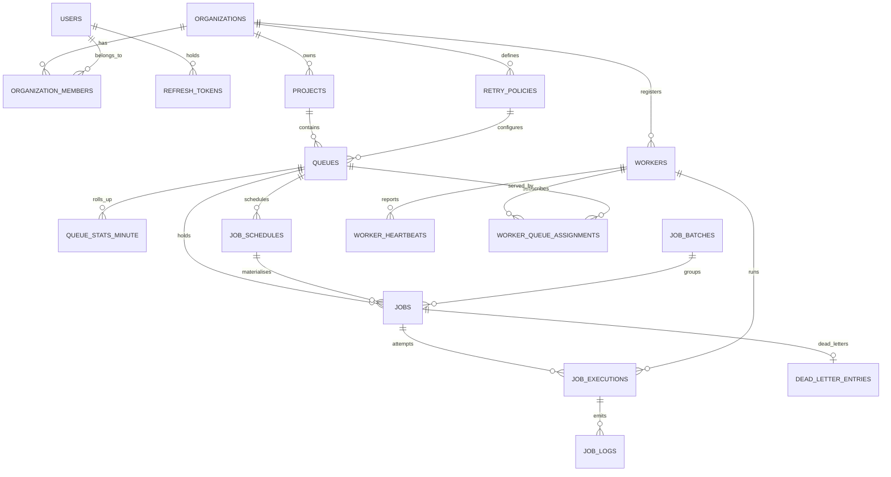
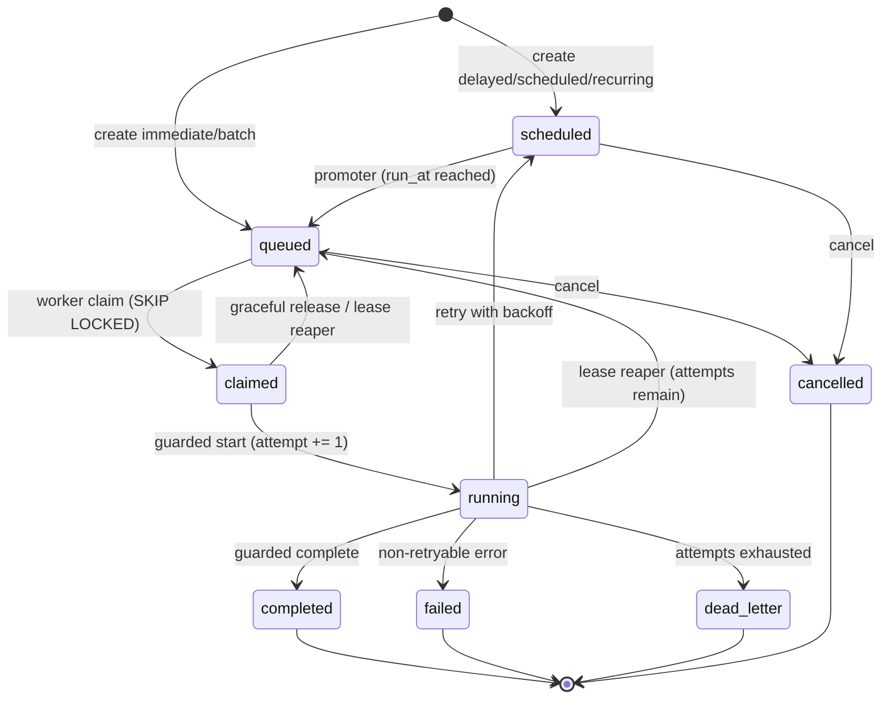

# Database Design

PostgreSQL 15 is the whole backend: system of record, queue substrate, lock manager, and clock.
Column and value names come from [`SCHEMA_NAMES.md`](SCHEMA_NAMES.md); the rationale behind each
structural choice is in [`DESIGN_DECISIONS.md`](DESIGN_DECISIONS.md).

Nineteen tables — eighteen entity tables plus the `queue_stats_minute` rollup. Tables land in
migration order across build slices; `uv run alembic current` and `\dt` in `psql` show what is live
in your database right now.

---

## 1. Conventions

- **UUIDv7, application-generated** for entity tables. Time-ordered, so inserts stay on the
  rightmost index page instead of dirtying a random leaf per row the way UUIDv4 does;
  non-enumerable, unlike a `bigint`; and generable by the client before the round trip.
- **`bigint GENERATED ALWAYS AS IDENTITY`** for the append-only high-volume children
  (`job_executions`, `job_logs`, `worker_heartbeats`, `queue_stats_minute`). They are never
  referenced externally, and 8 bytes beats 16 on the tables that grow fastest.
- **All timestamps `timestamptz`.** No naive timestamps anywhere, in the schema or in Python.
- **Native `ENUM`** for `job_status` and `execution_status`, because they drive partial indexes and
  the set is closed. **`TEXT` + `CHECK`** everywhere else, so values can evolve without `ALTER TYPE`
  and its lock.
- **`server_default=text(...)`, never a plain Python string.** A plain string is emitted as a DDL
  *literal*, which freezes the value at migration time — `now()` becomes the instant the migration
  ran. Every column a raw-SQL `INSERT` touches carries a server default, because raw SQL bypasses
  ORM defaults entirely.
- **Composite foreign keys carry the tenant.** `jobs` has `UNIQUE (id, organization_id)`, and
  `job_executions` references `(job_id, organization_id)`. A cross-tenant child row is therefore
  physically impossible rather than merely unlikely.

---

## 2. Entity relationships



`idempotency_keys` and `system_state` are omitted from the diagram: neither has an entity
relationship worth drawing. They are described in §3.

---

## 3. Table by table, and why it exists

### Tenancy and identity

| Table | Why |
|---|---|
| `organizations` | The tenant boundary. Every tenant-scoped table carries `organization_id`, and the composite FKs above make it non-forgeable. |
| `users` | Global identity. Argon2id password hash, plus `token_version` for global revocation on password change. |
| `organization_members` | Join table carrying `role` (`owner` \| `member`). PK `(organization_id, user_id)`. A constraint trigger prevents removing or demoting the last owner — otherwise an org becomes permanently unadministrable through a normal UI action. |
| `refresh_tokens` | Rotating refresh tokens keyed by `jti`, with `replaced_by_jti` so **reuse of a rotated token is detectable** and can revoke the whole chain. Without the back-pointer, a stolen refresh token is indistinguishable from a legitimate one. |
| `projects` | Namespace inside an org. Queue names are unique per project, not globally — which is why the worker's `--queues` takes `project-slug/queue-name`. |

### Configuration

| Table | Why |
|---|---|
| `retry_policies` | The spec names retry policies as an entity. Own table so a policy is reusable and nameable across queues — **and its values are snapshotted onto `jobs` at enqueue**, so editing a policy never retroactively changes the backoff of jobs already mid-retry. Referenced `ON DELETE RESTRICT`. |
| `queues` | The unit of concurrency, priority, lease length, payload limit, and pause. Carries `max_concurrency`, `priority`, `default_priority`, `visibility_timeout_sec`, `default_timeout_ms`, `max_payload_bytes`, `is_paused`/`paused_at`, `log_retention_days`. |

Two CHECKs on `queues` earn their place:

```sql
CONSTRAINT ck_queues_pause CHECK (is_paused = (paused_at IS NOT NULL))
CONSTRAINT ck_queues_timeout_lt_lease CHECK (default_timeout_ms < visibility_timeout_sec * 1000)
```

The second is the same invariant as `ck_jobs_timeout_lt_lease`, enforced one level up so a queue can
never be *configured* into guaranteed double execution.

### Work

| Table | Why |
|---|---|
| `jobs` | The hot table and the state machine. One row per unit of work, in one of eight statuses. |
| `job_schedules` | **A cron rule is not a job.** The recurrence rule (`cron`, `timezone`, `catchup_policy`, `max_catchup_occurrences`, `next_occurrence_at`, `last_occurrence_at`, `skipped_occurrences`) lives here; the materialised occurrences are `jobs` rows linked by `schedule_id` + `scheduled_for`. One schedule emits many jobs. |
| `job_batches` | Groups jobs submitted together. Progress is a `GROUP BY status` over `ix_jobs_batch`, not maintained counters — counters drift and need a reconciliation sweep nobody writes. |
| `job_executions` | **One row per attempt**, opened at *claim* time. Carries `attempt_number`, `worker_id`, `lease_epoch`, `status`, timings, `queue_wait_ms`, `duration_ms`, `next_retry_at`, error fields, and `result`. Because the row is created at claim rather than start, a worker that dies between claim and start leaves a real `lost` row — which is exactly what makes the `kill -9` story visible in the UI timeline. |
| `job_logs` | Execution logs, `(execution_id, seq)` unique, written only by `app/worker/logsink.py` in batches. "Maintain execution logs" is a core requirement; without one named owner this becomes a naive per-line `INSERT` on the hot path, or an empty table. |
| `dead_letter_entries` | Operator workflow: `payload_snapshot`, `error_fingerprint`, `resolution`, `resolved_by`, `replayed_job_id`. This does not belong on the hot `jobs` row, and the `dead_letter` *status* completes the state machine independently. |

### Fleet

| Table | Why |
|---|---|
| `workers` | Fleet registry keyed `(organization_id, name)`. Denormalised `last_heartbeat_at` serves the hot liveness check; `drain_requested` rides back to the worker on the heartbeat's `RETURNING`. |
| `worker_heartbeats` | Append-only history. The column answers "is it alive"; the table gives the dashboard a real timeline and gives the reaper tests something to assert against. |
| `worker_queue_assignments` | Which worker subscribes to which queue. Lets the dashboard answer "this queue has no workers", which is otherwise indistinguishable from "this queue is idle" — and that distinction is the single most common false "the system is broken" report. |

### Infrastructure

| Table | Why |
|---|---|
| `idempotency_keys` | `(organization_id, key)` with the request hash and stored response, committed **in the same transaction as the job insert**. Two transactions cannot make this atomic. |
| `system_state` | One row per scheduler loop (`promoter`, `cron`, `reaper`, `retention`) with `last_run_at` and `last_error`. Cross-process staleness needs a durable home; see `ARCHITECTURE.md` §5. |
| `queue_stats_minute` | Per-minute rollup for the throughput chart, so the dashboard never aggregates the hot `jobs` table. |

---

## 4. The `jobs` table and its invariants

The CHECK constraints are not defensive decoration; each one closes a specific failure that has no
other guard.

```sql
CONSTRAINT ck_jobs_timeout_lt_lease CHECK (timeout_ms < lease_seconds * 1000)
```
A job with a 24-hour timeout on a five-minute-lease queue is reclaimed and re-run **while it is
still executing**. Guaranteed double execution, on a path with no error and no alarm. This makes it
un-insertable.

```sql
CONSTRAINT ck_jobs_occurrence CHECK ((schedule_id IS NULL) = (scheduled_for IS NULL))
```
`scheduled_for` is meaningless without a schedule, and a schedule occurrence without its instant
cannot be deduplicated by `ux_jobs_schedule_occurrence`.

```sql
CONSTRAINT ck_jobs_lease_present CHECK (
    status NOT IN ('claimed','running')
    OR (lease_expires_at IS NOT NULL AND claimed_at IS NOT NULL)
)
```
An in-flight job with no lease is invisible to the reaper — it hangs forever.

```sql
CONSTRAINT ck_jobs_terminal_finished CHECK (
    (status IN ('completed','failed','dead_letter','cancelled')) = (finished_at IS NOT NULL)
)
```
Terminal means finished. Note the biconditional: it also rejects a `finished_at` on a live job. Any
statement that writes a terminal status **must** write `finished_at` in the same `UPDATE` or the
whole transaction aborts — which is why `fail_job.sql` sets it explicitly on the dead-letter branch.

`lease_seconds` is snapshotted from `queues.visibility_timeout_sec` at enqueue. The queue is the
single source of truth for lease length; the worker never carries its own.

---

## 5. Status state machine



**Terminal states have zero out-edges.** Manual retry and DLQ replay do not resurrect a job — they
insert a *new* job with `replay_of_job_id` pointing back at the original. History stays immutable,
the timeline stays truthful, and the trigger below stays simple enough to read.

Enforcement is in the database, not only in Python. A `BEFORE UPDATE` trigger
`enforce_job_status_transition` rejects any edge not in this diagram with SQLSTATE `23514`, and
rejects `NEW.attempt < OLD.attempt`. `app/domain/enums.py` holds the same edge set as
`LEGAL_TRANSITIONS`, and a test asserts the two agree — one diagram, two enforcement points, no
drift.

Two edges deserve a note:

- **`claimed → running` increments `attempt`.** Not the claim. A job released from `claimed`
  provably never executed, so graceful shutdown needs no decrement and monotonicity is never
  violated.
- **`running → scheduled` is the retry edge**, never `running → queued`. See
  [ADR-006](DESIGN_DECISIONS.md).

---

## 6. Indexes, and the exact query each one serves

```sql
-- 1. The hot claim path. The partial predicate matches the claim query's WHERE exactly,
--    and the column order matches its ORDER BY, so the plan is an index scan with no Sort.
CREATE INDEX ix_jobs_claim ON jobs (queue_id, priority DESC, run_at ASC, id ASC)
    WHERE status = 'queued';

-- 2. Promoter: scheduled jobs that have come due.
CREATE INDEX ix_jobs_due ON jobs (run_at) WHERE status = 'scheduled';

-- 3. Reaper: expired leases.
CREATE INDEX ix_jobs_lease ON jobs (lease_expires_at) WHERE status IN ('claimed','running');

-- 4. Queue depth by status. Partial, so it covers the live set only and never job history.
CREATE INDEX ix_jobs_depth ON jobs (queue_id, status)
    WHERE status IN ('scheduled','queued','claimed','running');

-- 5-6. Job explorer keyset pagination, matching the cursor tuple (created_at, id).
CREATE INDEX ix_jobs_project_created ON jobs (project_id, created_at DESC, id DESC);
CREATE INDEX ix_jobs_queue_status_created ON jobs (queue_id, status, created_at DESC, id DESC);

-- 7. Batch progress aggregation.
CREATE INDEX ix_jobs_batch ON jobs (batch_id, status) WHERE batch_id IS NOT NULL;

-- 8. Idempotency, scoped to live statuses so a completed key is reusable and DLQ replay works.
CREATE UNIQUE INDEX ux_jobs_live_idempotency ON jobs (queue_id, idempotency_key)
    WHERE idempotency_key IS NOT NULL
      AND status IN ('scheduled','queued','claimed','running');

-- 9. Exactly one job per cron occurrence. This is what makes N schedulers safe.
CREATE UNIQUE INDEX ux_jobs_schedule_occurrence ON jobs (schedule_id, scheduled_for)
    WHERE schedule_id IS NOT NULL;

-- 10. At most one open execution per job. The reaper closes orphans, so this never wedges a job.
CREATE UNIQUE INDEX ux_job_executions_open_one ON job_executions (job_id)
    WHERE finished_at IS NULL;

-- 11-13. Attempt history, log paging, open DLQ.
CREATE INDEX ix_job_executions_job ON job_executions (job_id, attempt_number DESC, id DESC);
CREATE INDEX ix_job_logs_exec_seq ON job_logs (execution_id, seq);
CREATE INDEX ix_dlq_open ON dead_letter_entries (project_id, dead_lettered_at DESC)
    WHERE resolution IS NULL;
```

| # | Index | Serves |
|---:|---|---|
| 1 | `ix_jobs_claim` | `claim_jobs.sql` — `WHERE queue_id = $1 AND status = 'queued' ORDER BY priority DESC, run_at ASC, id ASC LIMIT n FOR UPDATE SKIP LOCKED` |
| 2 | `ix_jobs_due` | `promote_due.sql` — `WHERE status = 'scheduled' AND run_at <= now()` |
| 3 | `ix_jobs_lease` | `reap_leases.sql` — `WHERE status IN ('claimed','running') AND lease_expires_at < now()` |
| 4 | `ix_jobs_depth` | `GET /queues/{id}/stats` — `SELECT status, count(*) … WHERE queue_id = $1 GROUP BY status` |
| 5 | `ix_jobs_project_created` | `GET /projects/{id}/jobs` keyset page — `(created_at, id) < cursor ORDER BY created_at DESC, id DESC` |
| 6 | `ix_jobs_queue_status_created` | the same page filtered by queue and status (the DLQ view is `?status=dead_letter`) |
| 7 | `ix_jobs_batch` | `GET /batches/{id}` — `GROUP BY status WHERE batch_id = $1` |
| 8 | `ux_jobs_live_idempotency` | the `Idempotency-Key` uniqueness check on job creation |
| 9 | `ux_jobs_schedule_occurrence` | the cron dispatcher's `ON CONFLICT (schedule_id, scheduled_for) DO NOTHING` |
| 10 | `ux_job_executions_open_one` | invariant, not a lookup: at most one open attempt per job |
| 11 | `ix_job_executions_job` | `GET /jobs/{id}/executions` and the UI timeline |
| 12 | `ix_job_logs_exec_seq` | `GET /jobs/{id}/logs` ascending keyset, and the log sink's `ON CONFLICT` |
| 13 | `ix_dlq_open` | `GET /projects/{id}/dlq` — unresolved entries, newest first |

`test_claim_uses_partial_index` runs `EXPLAIN` over the real claim statement and asserts it
references `ix_jobs_claim` with no `Seq Scan` and no `Sort`. An index that the planner declines to
use is not an optimisation, it is a comment with a maintenance cost.

**A deliberate omission:** there is **no** `UNIQUE (job_id, attempt_number)` on `job_executions`. A
claim that dies before starting leaves a `lost` row at attempt N, and the next claim legitimately
produces a second row at attempt N. Both are real history, and the timeline is more honest for
showing them. The uniqueness that actually matters — at most one *open* execution — is index 10.

---

## 7. Retention

`job_logs` and `job_executions` are the volume tables. A scheduler loop removes rows older than
`queues.log_retention_days` (default 7) in batches of 5000 per tick. Batching keeps each statement
inside one short transaction instead of taking a long lock and bloating WAL in one shot.

The `jobs` purge is guarded so it never destroys evidence: a job is only removed when no unresolved
`dead_letter_entries` row references it (`NOT EXISTS (… WHERE q.job_id = j.id AND q.resolution IS
NULL)`).

`dead_letter_entries.job_id` is `ON DELETE RESTRICT`, **not** `CASCADE`. An unresolved DLQ entry is
the operator's workflow record and must outlive retention; cascading it away would mean the system
quietly discards the failures a human still has to act on.

**Next step at real volume:** monthly declarative partitioning of `job_logs` and `job_executions` by
`created_at`, so retention becomes a partition detach — O(1) and lock-light — instead of a batched
row-by-row sweep. Not implemented at this scale, where the batched sweep is measurably sufficient
and partitioning would add migration complexity with no observable benefit.

---

## 8. Multi-tenancy enforcement

Enforcement is **application-level**: a `TenantSession` installs a SQLAlchemy `with_loader_criteria`
hook that injects `organization_id = :current_org` into every query against a tenant-scoped model,
backed by the composite foreign keys in §1. A CI test asserts that every tenant-scoped model emits
an `organization_id` predicate.

Postgres RLS is **deliberately not implemented** — see [ADR-013](DESIGN_DECISIONS.md). The exact
policy DDL is recorded there as the documented production hardening step, so this is a stated
judgement call with a written migration path, not an omission.

---

## 9. Migration order

The chain must topologically sort, and CI runs `alembic upgrade head` then `downgrade base` against
an empty database to prove it:

`0001` organizations, users, organization_members → `0002` refresh_tokens (+ `users.token_version`)
→ `0003` projects → `0004` retry_policies, queues → `0005` job_batches, job_schedules → `0006` jobs
+ transition trigger → `0007` workers, worker_queue_assignments, worker_heartbeats → `0008`
job_executions, job_logs → `0009` dead_letter_entries → `0010` idempotency_keys, system_state →
`0011` hot-path indexes → `0012` queue_stats_minute.

Where a cycle is genuinely unavoidable — `jobs.worker_id` ↔ `workers.id` — the table is created
first and the FK added later with `op.create_foreign_key`.
